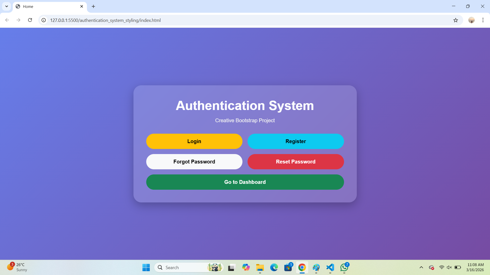
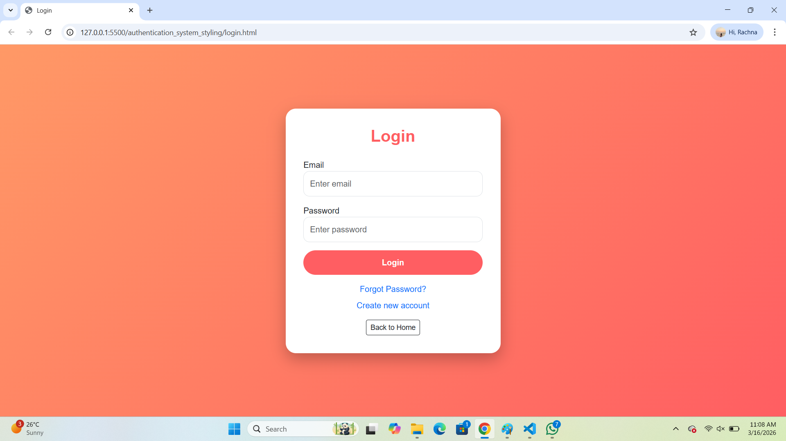
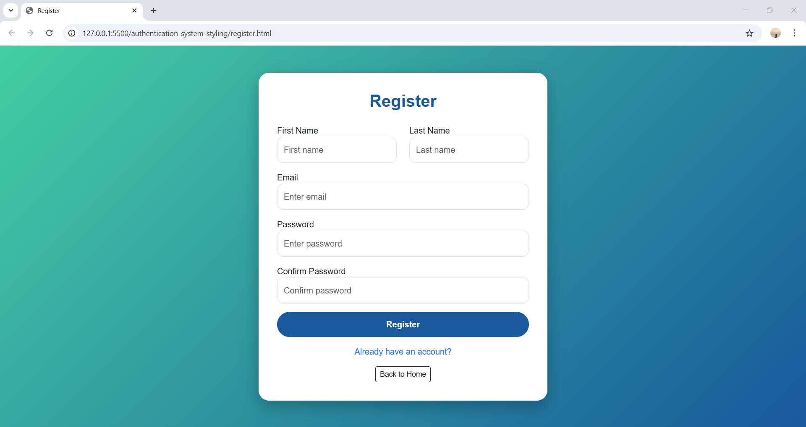
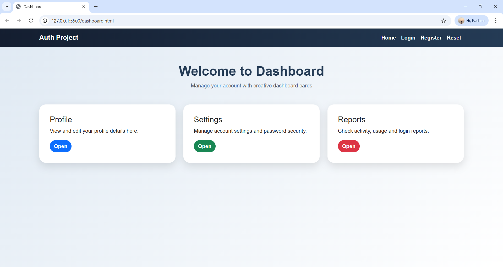

# authentication_sys_styling
A responsive **Authentication System UI** built using HTML, CSS, and Bootstrap 5.  
This project demonstrates a basic authentication workflow including Login, Registration, Forgot Password, Reset Password, and Dashboard pages.

The goal of this project is to practice **Bootstrap styling, responsive layouts, and clean UI design**.

## Project Description

This project contains a simple front-end authentication interface.  
It includes multiple pages that simulate how a real authentication system works in web applications.

The pages are styled using **Bootstrap 5 components such as cards, forms, buttons, grid system, and responsive utilities** along with custom CSS styling.

## Technologies Used

- HTML5
- CSS3
- Bootstrap 5
- Responsive Web Design

## Project Pages

1. Home Page (index.html)
The main landing page that provides navigation to all authentication pages.

2. Login Page (login.html)
Allows existing users to log into the system using email and password.

3. Register Page (register.html)
Allows new users to create an account by entering personal details.

4. Forgot Password Page (forgot.html)
Allows users to request password reset instructions.

5. Reset Password Page (reset.html)
Allows users to update their password.

6. Dashboard Page (dashboard.html)
Displays a simple dashboard layout after login.

## Features

- Responsive layout using Bootstrap
- Clean and modern UI design
- Form styling using Bootstrap components
- Navigation between authentication pages
- Dashboard layout with cards
- Mobile-friendly design
---

## Screenshots

### Home Page

### Login Page

### Register Page

### Dashboard

## Learning Outcome

Through this project I learned:

- Bootstrap layout and components
- Responsive web design
- Creating structured multi-page UI
- Using GitHub for project hosting
- 
## Author
Rachna Kallimani
Engineering Student | Learning Web Development

## Repository Link

GitHub Repository:  
https://github.com/rachnakallimani15/authentication_sys_styling
